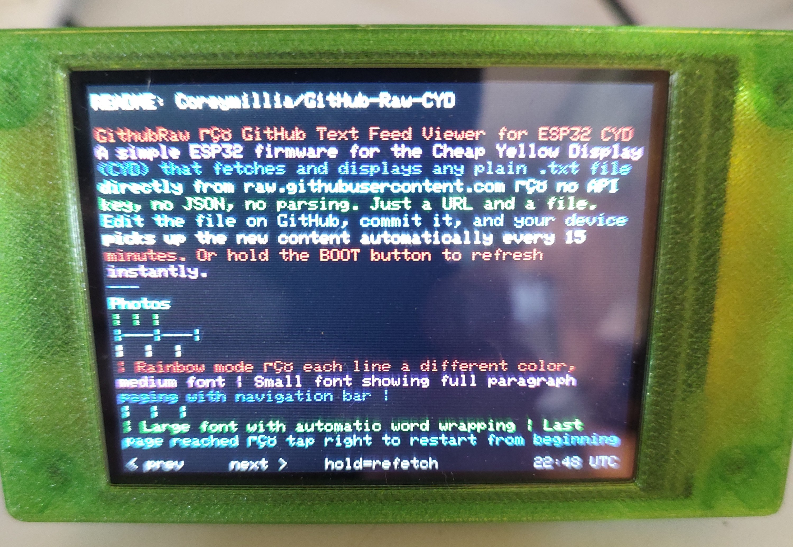
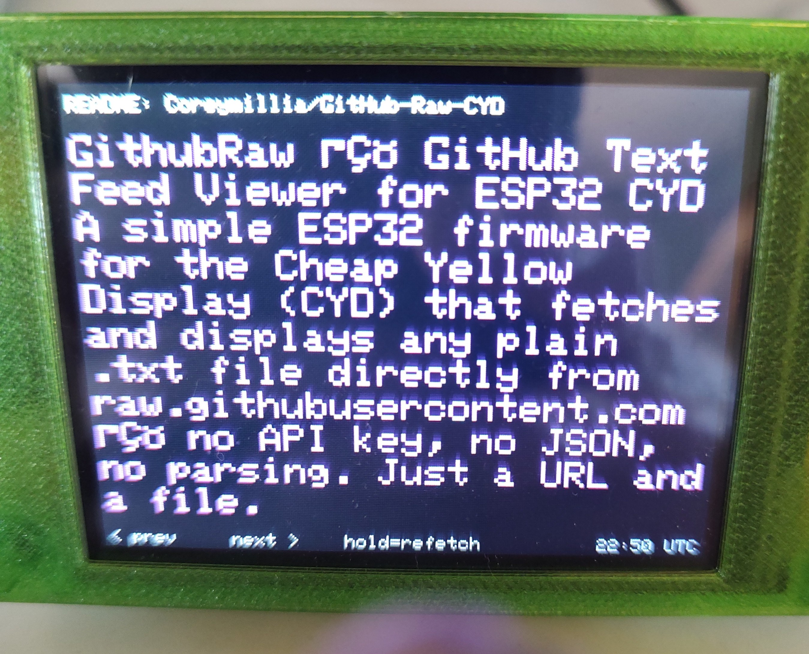

# GithubRaw — GitHub README Viewer for ESP32 CYD

An ESP32 firmware for the **Cheap Yellow Display (CYD)** that fetches and displays the **README.md** of any public GitHub repository directly on your screen. No API key, no JSON, no tokens. Just enter a repo name and go.

Markdown is automatically stripped so the text reads cleanly as plain paragraphs. Touch the screen to page through long READMEs. The device refreshes automatically every 15 minutes.

---

## Photos

| | |
|---|---|
|  |  |
| *Rainbow mode — reading its own GitHub README, small font* | *Large font — status bar shows active repo, navigation hints at bottom* |

---

## What It Does

Point it at any public GitHub repo and it displays the README on your desk — live. Edit the README on GitHub, commit, and the device picks up the change automatically. It even reads its own README.

### What can you use it for?

**Follow a project you care about:**
- Watch a project's README evolve as it's developed — no browser needed
- Keep a favorite open-source tool's documentation on your desk for quick reference
- Follow a developer's personal profile README as they update it

**If you maintain GitHub repos:**
- Use your own README as a live status board — edit it from your phone, it updates on your display
- Post announcements, notes, or changelogs in your README and your followers can display them
- Keep your project's current version and status visible at a glance

**Personal use:**
- Display your own notes repo README as a desktop info panel
- Follow a wiki-style repo someone maintains as plain text documentation
- Use a README as a personal daily brief — edit it once, read it everywhere

**The key idea:** Any public GitHub repo's README works. If someone is maintaining a public repo, you can read their README on your desk in real time.

---

## Hardware Required

- **ESP32 CYD** (Cheap Yellow Display) — ESP32 + ILI9341 2.8" 320×240 touchscreen
  - Any standard CYD with the common pinout works
  - A **white-background (inverted) CYD** is also supported — use the `INVERTEDrm` firmware folder
- USB cable for flashing
- 2.4 GHz WiFi network

---

## Software Required

- [PlatformIO](https://platformio.org/) (VS Code extension recommended)
- No accounts or API keys needed

---

## Setup

### 1. Flash the firmware

Open the project folder in VS Code with PlatformIO and click **Upload**.

> For white-background displays, flash from the `INVERTED` folders instead.
> NOTE: THE COLOR SETTINGS IN THE AP DO NOT WORK CORRECTLY FOR THE INVERTED VERSION. I DID NOT TRY TO FIX. 

### 2. Configure via the setup portal

On first boot the CYD starts a WiFi access point named **GithubRaw_Setup**.

1. Connect your phone or laptop to **GithubRaw_Setup**
2. A captive portal should open. If it does not, then go to step 3 with your mobile data turned off. 
3. Open a browser and go to **192.168.4.1**
4. Fill in:
   - **WiFi SSID** and **Password** (2.4 GHz only)
   - **GitHub Repo** — just `username/reponame`, e.g. `torvalds/linux`
   - **Text Color** — White, Green, Cyan, Yellow, Orange, Red, or 🌈 Rainbow
   - **Text Size** — Small, Medium, or Large
5. Tap **Save & Connect**

> **To re-enter setup** on any boot: hold the BOOT button while powering on.

---

## Controls

| Action | What it does |
|---|---|
| **Tap right half of screen** | Next page |
| **Tap left half of screen** | Previous page |
| **Short press BOOT button** | Next page (backup) |
| **Hold BOOT button (~1 sec)** | Re-fetch README immediately, return to page 1 |
| **Auto (every 15 minutes)** | Silently re-fetches and returns to page 1 |

The bottom bar always shows `< prev  next >  hold=refetch` and a UTC clock.

---

## Display Modes

| Mode | Description |
|---|---|
| **Small** | Most lines per screen, great for long READMEs |
| **Medium** | Balanced size and readability |
| **Large** | Easy to read from a distance |
| **🌈 Rainbow** | Each line a different color — cycles through cyan, green, yellow, orange, red, magenta, white |

Markdown is stripped automatically: headers, bold, italic, links (text kept, URL removed), images removed, code fences removed, HTML tags stripped.

---

## Project Structure

```
├── src/
│   └── main.cpp          # Fetch, Markdown strip, paginate, render, touch
├── include/
│   ├── Portal.h          # Captive portal + NVS settings (repo, color, size)
│   └── HTTPS.h           # HTTPS GET → String
├── INVERTEDrm/           # White-background display variant
│   ├── src/main.cpp
│   └── include/
├── platformio.ini
└── README.md
```

---

## Dependencies

| Library | Purpose |
|---|---|
| [GFX Library for Arduino](https://github.com/moononournation/Arduino_GFX) | ILI9341 display driver |
| [XPT2046_Touchscreen](https://github.com/PaulStoffregen/XPT2046_Touchscreen) | Resistive touchscreen |
| WiFiClientSecure / HTTPClient | Built-in ESP32 Arduino core |
| Preferences | NVS flash storage for settings |

All dependencies are managed automatically by PlatformIO.

---

## Notes

- Only **public** repositories work — no auth is used
- Fetches `HEAD/README.md` — works with both `main` and `master` branches
- The ESP32 supports **2.4 GHz WiFi only**
- GitHub's raw CDN typically updates **3–5 minutes** after a commit

---

*Built for the ESP32 CYD. Firmware written with PlatformIO and Arduino framework.*
